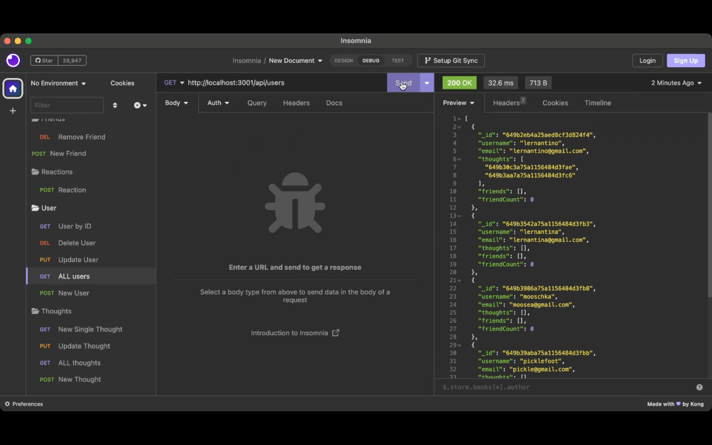

# social-network-api

## Description

This is an API created for a social media application where users can interact with each other by creating friend lists, adding thoughts, and adding reactions to thoughts. This API uses Express.js for routing, a MongoDB database, the Mongoose ODM, and Moment.js to format timestamps. The seed data is created using Insomnia.

## Installation

To run this project, install it locally using npm:

npm install

After installing npm packages, start the application with:

npm start

## Usage

Follow the walkthrough video to see how it works!

[Video](https://drive.google.com/file/d/1DYDKhkbmiibht9L9XxlP6x0cfD-dkuG5/view)

## Questions

For questions about this repository, please contact me.

